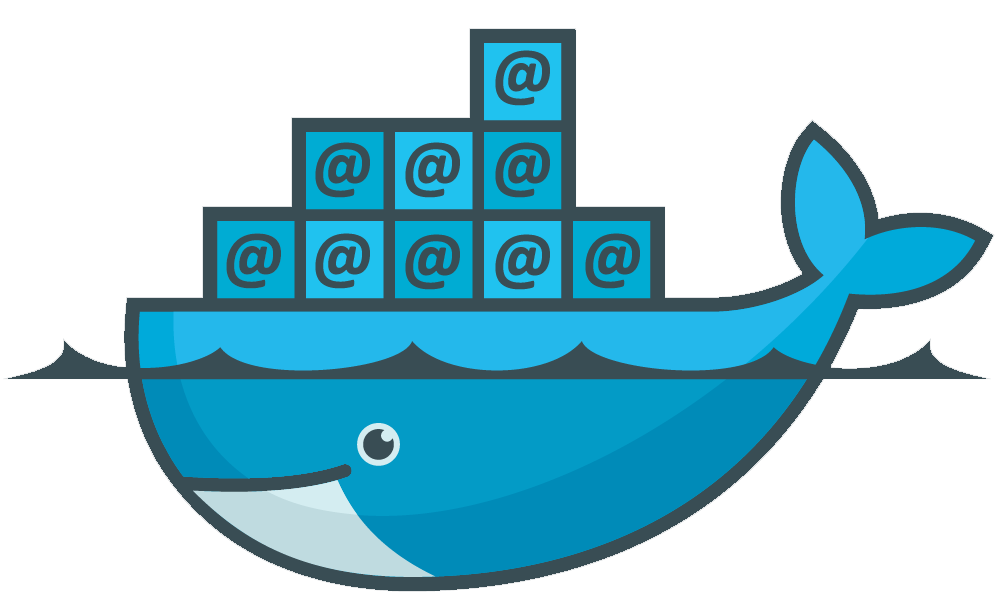

# Email services as a docker container

The ``foxylion/mail`` container provides all important mail services to serve
emails from your server. It includes ``postfix``, ``dovecot``, ``amavis``,
``clamav``, ``spamassassin`` and ``postfixadmin``.
